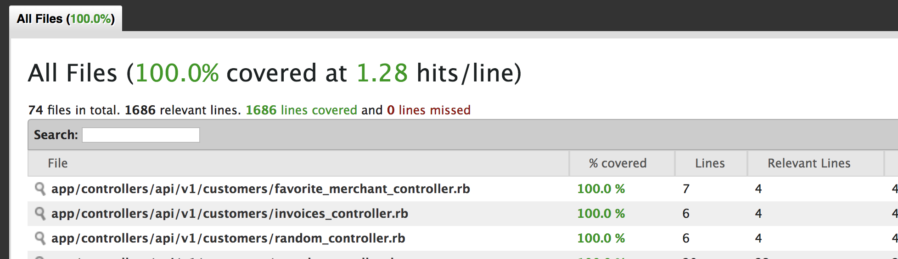
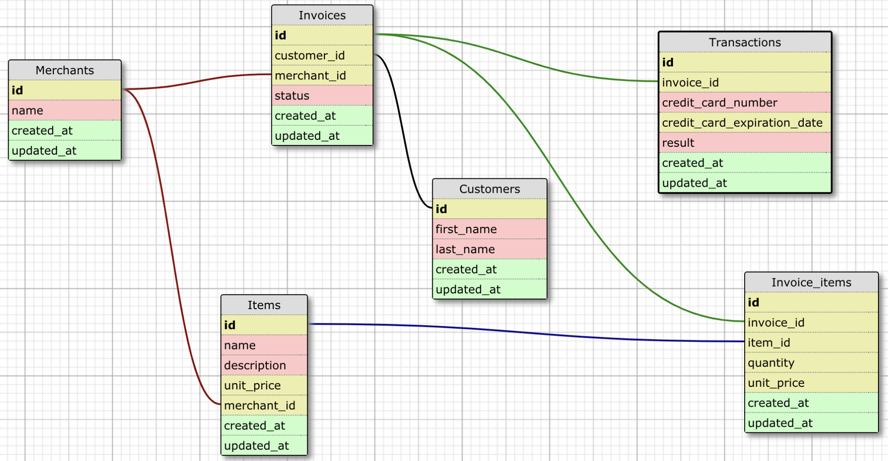

## Rails Engine
This is a project designed to use Rails and ActiveRecord in order to build a JSON API which exposes the SalesEngine data schema.

* Author: Leah K. Miller

## Learning Goals
- Learn how to build Single-Responsibility controllers to provide a well-designed and versioned API
- Learn how to use controller tests to drive your design
- Use Ruby and ActiveRecord to perform more complicated business intelligence

## Tech Used
- Rails
- PostgreSQL
- RSpec
- FactoryBot
- ShouldaMatchers
- SimpleCov


* Ruby version - ruby 2.4.5

* I used RSpec tests to drive my development; SpecHarness is also available


* Table Relationships as follows:


* I wrote a blog post!
Please feel free to visit: https://medium.com/@le3ah/rails-engine-a5d2e3aab1ce

* I imported the database files using an `import.rake` file.  Code example:
```desc "Imports a CSV of all entities"
task :customer_import => :environment do
  CSV.foreach('./db/data/customers.csv', :headers => true ) do |row|
    Customer.create!(row.to_h)
  end
end```
